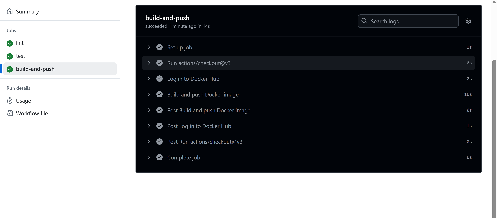
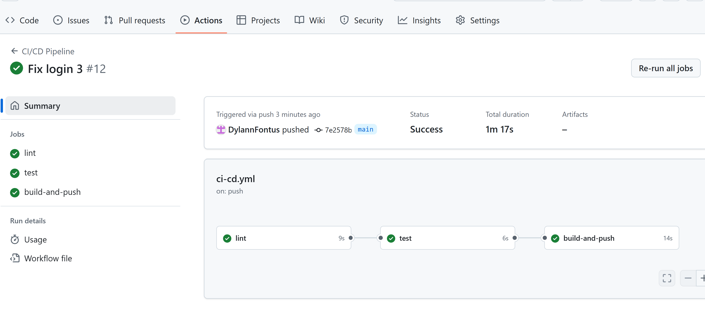

# Lab0_Log430
## Architecture du Projet

Le projet **Lab0_Log430** est un simple programme en Python qui retourne un simple hello world ( ne le print pas, simplement le retourne ). Le Python à été choisi, car il était le language le plus simple à mettre en place que je connaisse. Voici les principaux composants :

- **LAB0_LOG430/** : Contient le code source principal du projet ainsi que les tests et les fichiers reliés au docker.
- **.github/workflows/** : Contient les fichiers concernant la pipeline CI/CD sur GitHub

C'est un projet assez simple, donc il n'y a pas eu nécessité de créer plus de dossier dans l'architecture.

## Structure du Projet

Voici une vue d'ensemble de la structure des dossiers et fichiers :

```
Lab0_Log430/
├── .github/
│   └── workflows/
│       └── ci-cd.yml
├── .gitignore
├── docker-compose.yml
├── Dockerfile.txt
├── hellowrld.py
├── test_hello_world.py.txt
└── README.md
```
## Instructions

Voici les étapes du projet :
1. À l'aide de Github Desktop, il faut cloner le répertoire avec le lien http
2. J'ai installé python avec les extentions de VS Code ( commande : sudo apt install python3-pip )
3. J'ai créer un fichier helloworld.py et j'ai codé une simple fonction qui retourne Hello, World!
4. J'ai installé pytest avec le terminal ( commande : sudo apt install python3-pytest )
5. J'ai créer un fichier test_hello_world.py et j'ai codé deux tests
6. J'ai testé le tout en faisant la commande : pytest test_hello_world.py
7. J'ai ensuite installé Docker à travers les extensions VS Code ( commande : sudo apt install docker-compose )
8. J'ai créer un fichier appelé Dockerfile et un autre docker-compose.yml et j'ai mis les informations correspondantes
9. J'ai fait les commandes : docker build -t helloworld ., docker run helloworld:latest, docker compose up
10. Le containeur à été créer
11. J'ai fait la commmande : sudo apt install pylint
12. J'ai créer les dossiers .github et workflows, puis j'ai créer à l'intérieur le fichier ci-cd.yml, j'ai ensuite ajouté les informations correspondantes à ce fichier
13. J'ai créer un compte Docker hub puis j'ai créer mes access tokens que j'ai ensuite intégrér aux paramètres de mon projet Github
14. J'ai refait les commandes de l'étapes 9
15. J'ai push le projet et etl'intégration s'est terminé avec succès

## Pipeline réussi

