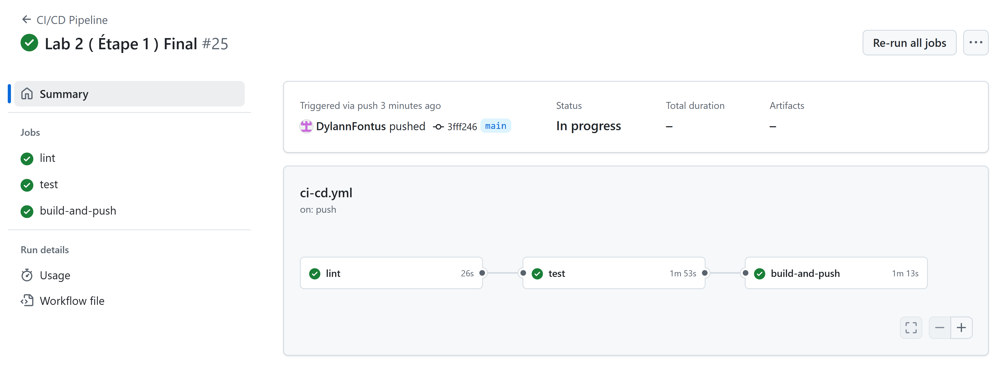

# Lab3_Log430

## Description

Lab0_Log430 est une application de gestion de point de vente (POS) développée en Python avec le framework Django. Elle permet de gérer les magasins, les produits, les ventes, les stocks et propose une interface web moderne. Le projet est conçu pour être facilement déployé et testé grâce à Docker et à une architecture modulaire.

---

## Instructions de démarrage

### Prérequis

- **Python 3.8+**
- **Docker** et **docker-compose**
- **MySQL** (utilisé via Docker)
- **pip** (gestionnaire de paquets Python)

### 2. Lancer l’application avec Docker Compose

```bash
docker-compose down -v --remove-orphans
docker compose build --no-cache
docker compose up
```

Cela va :
- Construire l’image de l’application Django
- Lancer un conteneur MySQL avec la base `magasin`
- Lancer l’application web Django dans un conteneur dédié

### 3. Accéder à l’application

Ouvrez votre navigateur et rendez-vous sur [http://10.194.32.186:5000](http://10.194.32.186:5000) pour accéder à l’interface web.

Le username est : useradmin
Le mot de passe est : asmoday1

### 4. Lancer les tests

Pour exécuter les tests unitaires :

```bash
docker-compose down -v --remove-orphans
docker compose build --no-cache
docker compose up -d
docker compose exec web python manage.py test_db
docker compose exec web pytest
```

---

## Choix technologiques et justification

- **Python** : Langage simple, expressif et rapide à prototyper, idéal pour les applications métiers.
- **Django** : Framework web robuste et structurant, facilite la séparation des responsabilités (modèles, vues, templates).
- **MySQL** : SGBD open-source, stable et performant, facilement intégrable avec Django et Docker.
- **pytest** : Framework de tests moderne et efficace pour Python, utilisé pour automatiser les tests unitaires.
- **Docker & docker-compose** : Permettent un déploiement reproductible, l’isolation des services (base de données, application) et facilitent la montée en production ou le développement collaboratif.

---

## Arborescence du projet

```
Lab0_Log430/
├── Dockerfile
├── Images
│   ├── Lab0
│   │   ├── PipelineCICDRéussi.png
│   │   └── PipelineCICDRéussi2.png
│   ├── LAB2
│   │   └── Etape1PipelineCICDRéussiLAB2.png
│   └── LAB3
│       ├── RedocPreuve.png
│       ├── SwaggerPreuve.png
│       ├── SwaggerPreuve2.png
│       └── PipelineCICDRéussiLAB3.png
├── README.md
├── __pycache__
│   ├── HelloWorld.cpython-312.pyc
│   └── test_hello_world.cpython-312-pytest-7.4.4.pyc
├── docker-compose.yml
├── docs
│   ├── ADR
│   │   ├── ADR1
│   │   └── ADR2
│   └── UML
│       ├── VueCasUtilisation.puml
│       ├── VueDeploiement.puml
│       ├── VueImplementation.puml
│       ├── VueLogique.puml
│       └── VueProcessus.puml
├── entrypoint.sh
├── requirements.txt
├── src
│   └── pos_django
│       ├── magasin
│       ├── manage.py
│       └── pos_django
├── start.sh
└── wait-for-it.sh
```
---

## Preuve Swagger


---


## Preuve Redoc

---

## Pipeline CI/CD

Le projet intègre une pipeline CI/CD via GitHub Actions :
- Linting avec pylint
- Tests automatiques avec pytest
- Build et push d’image Docker


---

