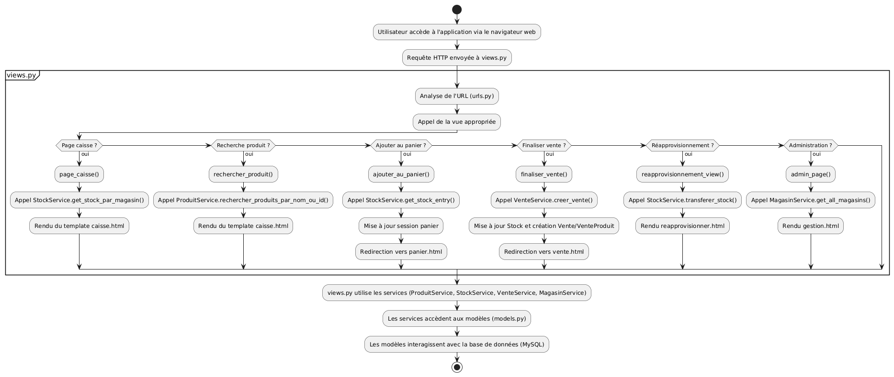
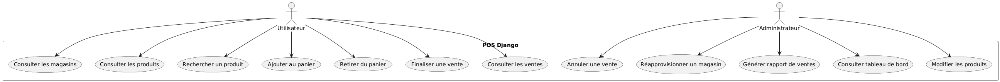
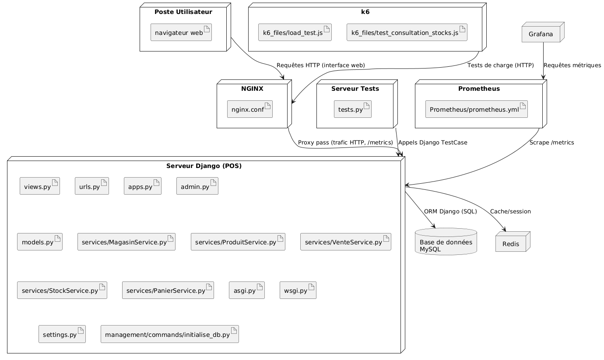

# Rapport d’Architecture – Labs 0, 1 et 2 (Dylann André Fontus)

## Répertoire GitHub Lab 0: https://github.com/DylannFontus/Lab0_Log430/tree/Lab0FinalRelease
## Répertoire GitHub Lab 1: https://github.com/DylannFontus/Lab0_Log430/tree/Lab1FinalRelease
## Répertoire GitHub Lab 2: https://github.com/DylannFontus/Lab0_Log430/tree/Lab2FinalRelease

## 1. Introduction & objectifs

Ce document présente l’architecture du système de gestion de point de vente (POS) développé lors des Labs 0, 1 et 2.  
L’objectif est de fournir une solution modulaire, testable et évolutive pour la gestion des ventes, des stocks et de la supervision multi-magasins.  
Cette documentation s’adresse aux développeurs, architectes, responsables techniques et parties prenantes métier.

---

## 2. Contraintes & exigences de qualité

### Contraintes fonctionnelles
- Respect du modèle métier : gestion des magasins, stocks, ventes, produits, transferts logistiques.
- Interface web ergonomique et responsive.
- Gestion multi-rôles (caissier, logisticien, administrateur, maison mère).
- Journalisation des opérations sensibles (ventes, transferts, modifications).
- Tests automatisé ( Pipeline CI/CD )
- BD MySQL

### Exigences de qualité
- **Performance** : temps de réponse < 1s pour les opérations courantes et < 30s pour la connection à la db.
- **Sécurité** : gestion des accès, protection des données, conformité RGPD.
- **Évolutivité** : ajout de magasins, produits, utilisateurs sans refonte majeure.
- **Testabilité** : couverture de tests unitaires et d’intégration pytest.
- **Déploiement reproductible** : Docker, CI/CD.
- **Extensibilité** : architecture modulaire, séparation claire des responsabilités.

---

## 3. Contexte & portée

### Contexte métier
- **Acteurs** : caissier, client, administrateur, maison mère.
- **Systèmes tiers** : aucun pour l’instant (prévu : fournisseurs, ERP).
- **Interfaces** : interface web (navigateur), API Django (potentiellement REST à venir).

### Contexte technique
- **Plateformes** : Linux, Docker, Docker Compose.
- **Technologies** : Python 3.11, Django 5.x, MySQL, pytest, GitHub Actions.
- **Dépendances** : sqlalchemy, pymysql, mysql-connector-python, pytest, Django, mysqlclient, django-environ, pytest-django

Sur le plan technique, le projet s’appuie sur un environnement moderne et robuste : il est conçu pour fonctionner sous Linux, avec une orchestration via Docker et Docker Compose pour faciliter le déploiement et l’isolation des services. Le développement utilise Python 3.11 et Django 5.x pour la partie backend, avec une base de données MySQL. Les tests sont automatisés grâce à pytest et pytest-django, et l’intégration continue est assurée par GitHub Actions. Les dépendances principales sont listées dans le fichier requirements.txt, ce qui garantit la reproductibilité de l’environnement de développement.

La portée actuelle du projet se limite à la gestion interne du point de vente, via une interface web et une API Django. L’extension vers des systèmes tiers et des fonctionnalités avancées est prévue dans les phases ultérieures.

---

## 4. Solution conceptuelle

Le système est organisé autour de trois sous-domaines :
- **Ventes en magasin** : gestion du panier, finalisation/annulation des ventes, consultation du stock local.
- **Gestion logistique** : transferts de stock, gestion du centre logistique, suivi des ruptures/surstocks.
- **Supervision maison mère** : rapports, tableaux de bord, modification des produits.

**Flux principal** :
1. L’utilisateur accède à l’application via le navigateur.
2. Les requêtes sont traitées par Django (`views.py`), qui délègue la logique métier aux services.
3. Les services manipulent les modèles et accèdent à la base MySQL via l’ORM.
4. Les réponses sont rendues via les templates HTML.

---

## 5. Vue statique (building block view)

### Structure modulaire

- **Présentation** : `templates/`, `views.py`, `urls.py`
- **Logique métier** : `services/` (`MagasinService.py`, `ProduitService.py`, `StockService.py`, `VenteService.py`)
- **Persistance** : `models.py`, `management/commands/initialise_db.py`
- **Tests** : `tests.py`

### Vue d'implémentation

### Diagramme UML de classes

---

## 6. Vue dynamique (runtime view)

### Scénario clé : Vente en magasin

1. L’utilisateur sélectionne un produit et l’ajoute au panier (`ajouter_au_panier` dans `views.py`).
2. Le service vérifie le stock disponible (`StockService.get_stock_entry`).
3. L’utilisateur finalise la vente (`finaliser_vente`).
4. Le service crée la vente, met à jour les stocks, enregistre les lignes de vente (`VenteService.creer_vente`).
5. Les vues affichent la confirmation et le ticket de vente.

### Autres scénarios
- Réapprovisionnement : transfert de stock via `StockService.transferer_stock`.
- Annulation de vente : retour des produits en stock via `VenteService.annuler_vente`.
- Génération de rapports : agrégation des ventes et stocks via les services.

### Vue de processus

### Vue de cas d'utilisation

---

## 7. Vue de déploiement

- **Poste utilisateur** : navigateur web.
- **Serveur applicatif** : conteneur Docker Django (`web` dans `docker-compose.yml`).
- **Base de données** : conteneur MySQL (`db`).
- **CI/CD** : GitHub Actions pour lint, tests, build et push d’image Docker.

---

## 8. Vue des interfaces externes

- **Web** : interface HTML/CSS/JS servie par Django.
- **API interne** : vues Django (`views.py`) exposant les fonctionnalités via des routes définies dans `urls.py`.
- **Base de données** : accès via l’ORM Django (MySQL).
- **Commandes de gestion** : initialisation via `management/commands/initialise_db.py`.

---

## 9. Concepts transverses (crosscutting concepts)

- **Sécurité** : gestion des sessions Django, CSRF, permissions à renforcer.
- **Gestion des erreurs** : messages utilisateur via `django.contrib.messages`, gestion des exceptions dans les services.
- **Journalisation** : logs Django, messages d’audit à prévoir pour les opérations critiques.
- **Internationalisation** : non implémentée, mais Django le permet nativement.
- **Tests** : couverture via `pytest`, `pytest-django`, mocks dans `tests.py`.
- **Déploiement** : Docker, scripts `start.sh` et `entrypoint.sh`, pipeline CI/CD.

---

## 10. Décisions architecturales

### Justification des choix technologiques

- **Docker & Docker Compose** : facilitent la portabilité, l’isolation et la reproductibilité de l’environnement de développement et de production. Permettent de déployer rapidement l’application et ses dépendances (base de données, services) sur n’importe quelle machine.
- **Python** : langage moderne, lisible et largement utilisé pour le développement web et les scripts d’automatisation. Dispose d’un vaste écosystème de bibliothèques.
- **Django** : framework web robuste, sécurisé et modulaire, adapté aux applications métier complexes. Offre un ORM performant, une gestion native des utilisateurs, des outils d’administration et une architecture MVC claire.
- **MySQL** : SGBD relationnel éprouvé, performant et bien supporté par Django. Idéal pour gérer des données structurées et garantir l’intégrité des transactions.
- **pytest** : framework de tests flexible et puissant, facilitant l’écriture de tests unitaires et d’intégration. S’intègre bien avec Django via `pytest-django`.
- **GitHub** : plateforme de gestion de code source collaborative, intégrant le versioning, la revue de code et l’automatisation CI/CD (GitHub Actions). Favorise le travail en équipe et la traçabilité des évolutions du projet.

### Séparation des responsabilités et arborescence du projet

L’architecture du projet suit le principe de séparation des responsabilités (Separation of Concerns), ce qui permet de rendre le code plus lisible, maintenable et évolutif. L’arborescence du dépôt est structurée pour refléter cette séparation :

- **Présentation** : Les fichiers `templates/`, `views.py` et `urls.py` gèrent l’affichage, la navigation et la réception des requêtes utilisateur. Ils sont responsables de l’interface et de la logique de présentation, sans inclure de logique métier complexe.
- **Logique métier** : Le dossier `services/` contient des modules spécialisés (`MagasinService.py`, `ProduitService.py`, etc.) qui encapsulent les règles métier et les opérations principales. Cela permet de centraliser la logique, d’éviter la duplication et de faciliter les tests unitaires.
- **Persistance** : Les modèles (`models.py`) définissent la structure des données et les relations, tandis que les scripts de gestion (`management/commands/initialise_db.py`) s’occupent de l’initialisation et de la migration des données.
- **Tests** : Le fichier `tests.py` regroupe les tests unitaires et d’intégration, assurant la robustesse du code.

Cette organisation permet :
- D’isoler les changements : une modification dans la logique métier n’impacte pas la présentation, et inversement.
- De faciliter la réutilisation : les services peuvent être appelés depuis différentes vues ou interfaces (web, API).
- De simplifier les tests : chaque couche peut être testée indépendamment.
- De préparer l’ouverture vers d’autres interfaces (API REST, CLI) sans refonte majeure.

En résumé, l’arborescence du projet reflète une séparation claire des responsabilités, ce qui favorise la qualité logicielle et la capacité d’évolution du système.

---

## 11. Qualité, risques & dette technique

### Risques principaux
- Sécurité insuffisante (authentification, autorisation à renforcer).
- Performance sur de gros volumes (requêtes ORM à optimiser).
- Couplage entre vues et logique métier à surveiller.
- Tests d’intégration à compléter.

### Dette technique
- Refactorisation des services pour éviter la duplication.
- Structuration des templates (héritage, composants).
- Documentation technique à enrichir.
- Prévoir l’ouverture vers des APIs REST.

---

## 12. Glossaire

- **POS** : Point Of Sale, système de gestion de caisse.
- **Magasin** : entité physique ou logique vendant des produits.
- **Centre logistique** : entité gérant le stock central et les transferts.
- **Maison mère** : entité supervisant l’ensemble du réseau.
- **Vente** : transaction enregistrée lors d’un achat.
- **Stock** : quantité de produits disponibles dans un magasin.
- **Service** : composant métier réalisant une opération (vente, transfert…).
- **Template** : fichier HTML généré côté serveur.
- **ADR** : Architectural Decision Record, documentant une décision structurante.

---