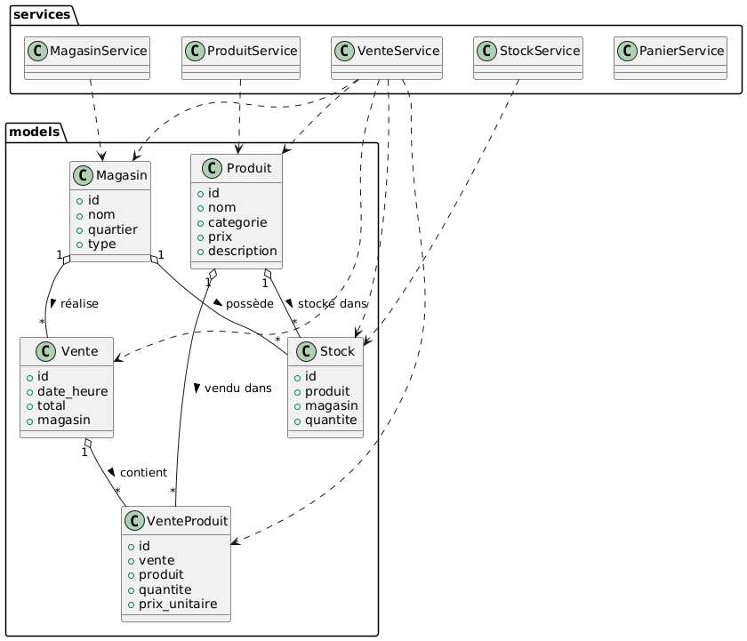

# Rapport d’Architecture – Lab 3, 4, 5 (Dylann André Fontus)

## Répertoire GitHub Lab 3: https://github.com/DylannFontus/Lab0_Log430/tree/Lab3FinalRelease
## Répertoire GitHub Lab 4: https://github.com/DylannFontus/Lab0_Log430/tree/Lab4FinalRelease
## Répertoire GitHub Lab 5: Inexistant

---

## 1. Introduction & objectifs

Ce document présente l’évolution de l’architecture du système de gestion de point de vente (POS) à l’étape 2, en mettant l’accent sur l’intégration de nouvelles technologies de supervision, de monitoring, de cache, d’API REST et de documentation interactive.  
L’objectif est de renforcer la robustesse, la visibilité, la performance et l’ouverture du système, tout en maintenant une architecture modulaire, testable et évolutive.  

---

## 2. Contraintes & exigences de qualité

### Contraintes fonctionnelles
- Respect du modèle métier : gestion des magasins, stocks, ventes, produits, transferts logistiques.
- Interface web ergonomique et responsive.
- Gestion multi-rôles (caissier, logisticien, administrateur, maison mère).
- Journalisation des opérations sensibles (ventes, transferts, modifications).
- Tests automatisés (Pipeline CI/CD).
- BD MySQL.
- Exposition d’une API REST documentée.
- Monitoring et supervision en temps réel.

### Exigences de qualité
- **Performance** : temps de réponse < 1s pour les opérations courantes, < 30s pour la connexion à la DB.
- **Sécurité** : gestion des accès, protection des données, conformité RGPD, gestion CORS.
- **Évolutivité** : ajout de magasins, produits, utilisateurs, endpoints API sans refonte majeure.
- **Testabilité** : couverture de tests unitaires et d’intégration (pytest, k6).
- **Déploiement reproductible** : Docker, CI/CD.
- **Extensibilité** : architecture modulaire, séparation claire des responsabilités.
- **Observabilité** : supervision, métriques, logs, alertes.

---

## 3. Contexte & portée

### Contexte métier
- **Acteurs** : caissier, client, logisticien, administrateur, maison mère.
- **Systèmes tiers** : aucun pour l’instant (prévu : fournisseurs, ERP).
- **Interfaces** : interface web (navigateur), API Django REST, documentation Swagger.

### Contexte technique
- **Plateformes** : Linux, Docker, Docker Compose.
- **Technologies** : Python 3.11, Django 5.x, MySQL, pytest, GitHub Actions, NGINX, Redis, Prometheus, Grafana, k6, Django REST Framework, Swagger (drf-yasg), django-cors-headers.
- **Dépendances** : voir `requirements.txt` (sqlalchemy, pymysql, mysql-connector-python, pytest, Django, mysqlclient, django-environ, pytest-django, djangorestframework, drf-yasg, django-cors-headers, django-prometheus, django-redis, structlog…).

Le projet s’appuie désormais sur un environnement complet :  
- **NGINX** comme reverse proxy HTTP.
- **Redis** pour le cache et les sessions Django.
- **Prometheus** pour la collecte de métriques.
- **Grafana** pour la visualisation des métriques.
- **k6** pour les tests de charge.
- **Django REST Framework** pour l’API REST.
- **Swagger (drf-yasg)** pour la documentation interactive de l’API.
- **CORS** géré via django-cors-headers pour l’ouverture de l’API à des clients externes.

---

## 4. Solution conceptuelle

Le système est organisé autour de trois sous-domaines :
- **Ventes en magasin** : gestion du panier, finalisation/annulation des ventes, consultation du stock local.
- **Gestion logistique** : transferts de stock, gestion du centre logistique, suivi des ruptures/surstocks.
- **Supervision maison mère** : rapports, tableaux de bord, modification des produits, supervision et monitoring.

**Flux principal** :
1. L’utilisateur accède à l’application via le navigateur ou un client API.
2. Les requêtes HTTP passent par NGINX, qui reverse-proxy vers Django.
3. Django traite la logique métier via les services, accède à la base MySQL et au cache Redis.
4. Les métriques sont exposées à Prometheus, visualisées dans Grafana.
5. Les tests de charge sont réalisés via k6.
6. L’API REST est documentée et testable via Swagger.

---

## 5. Vue statique (building block view)

### Structure modulaire

- **Présentation** : `templates/`, `views.py`, `urls.py`
- **API REST** : `serializers.py`, `api_views.py`, `urls.py`, documentation Swagger (drf-yasg)
- **Logique métier** : `services/` (`MagasinService.py`, `ProduitService.py`, `StockService.py`, `VenteService.py`, `PanierService.py`)
- **Persistance** : `models.py`, `management/commands/initialise_db.py`
- **Tests** : `tests.py`, scripts k6
- **Supervision** : intégration django-prometheus, dashboards Grafana, configuration Prometheus
- **Infrastructure** : `nginx.conf`, `docker-compose.yml`, `Dockerfile`, configuration Redis

### Vue d'implémentation

### Diagramme UML de classes

---

## 6. Vue dynamique (runtime view)

### Scénario clé : Consultation d’un endpoint API REST

1. Un client externe (ou Swagger UI) envoie une requête HTTP GET sur `/api/produits/`.
2. NGINX reverse-proxy la requête vers Django.
3. Django REST Framework traite la requête via un `APIView` ou un `ViewSet`.
4. Les données sont sérialisées, éventuellement récupérées via le cache Redis.
5. La réponse JSON est renvoyée au client.
6. Les métriques de la requête sont exposées à Prometheus.

### Autres scénarios
- Test de charge : k6 simule des requêtes concurrentes sur l’API ou l’interface web.
- Monitoring : Prometheus scrape les métriques, Grafana affiche les dashboards.
- Gestion CORS : un client JS externe accède à l’API grâce à la configuration django-cors-headers.

### Vue de processus

### Vue de cas d'utilisation

---

## 7. Vue de déploiement

- **Poste utilisateur** : navigateur web ou client API.
- **NGINX** : reverse proxy HTTP.
- **Serveur applicatif** : conteneur Docker Django (`web` dans `docker-compose.yml`).
- **Base de données** : conteneur MySQL (`db`).
- **Redis** : cache distribué et gestion des sessions.
- **Prometheus** : collecte des métriques exposées par Django.
- **Grafana** : visualisation des métriques.
- **k6** : tests de charge.
- **CI/CD** : GitHub Actions pour lint, tests, build et push d’image Docker.

---

## 8. Vue des interfaces externes

- **Web** : interface HTML/CSS/JS servie par Django via NGINX.
- **API REST** : endpoints exposés via Django REST Framework, documentés par Swagger (drf-yasg).
- **Base de données** : accès via l’ORM Django (MySQL).
- **Cache** : accès Redis via django-redis.
- **Monitoring** : endpoint `/metrics` exposé à Prometheus.
- **Commandes de gestion** : initialisation via `management/commands/initialise_db.py`.

---

## 9. Concepts transverses (crosscutting concepts)

- **Sécurité** : gestion des sessions Django, CSRF, permissions DRF, gestion CORS via django-cors-headers.
- **Gestion des erreurs** : messages utilisateur, gestion des exceptions dans les services et les API.
- **Journalisation** : logs Django, structlog, métriques Prometheus.
- **Internationalisation** : non implémentée, mais Django le permet nativement.
- **Tests** : couverture via `pytest`, `pytest-django`, scripts k6.
- **Déploiement** : Docker, scripts `start.sh` et `entrypoint.sh`, pipeline CI/CD.
- **Documentation interactive** : Swagger UI via drf-yasg.

---

## 10. Décisions architecturales

### Justification des choix technologiques

- **NGINX** : reverse proxy performant, gestion du SSL, équilibrage de charge.
- **Redis** : accélération du cache et des sessions, haute performance.
- **Prometheus** : collecte de métriques applicatives et système.
- **Grafana** : visualisation et alerting sur les métriques.
- **k6** : tests de charge reproductibles et scriptables.
- **Django REST Framework** : création rapide d’API RESTful robustes.
- **Swagger (drf-yasg)** : documentation interactive et testable de l’API.
- **django-cors-headers** : gestion fine des accès cross-origin pour l’API.

### Séparation des responsabilités et arborescence du projet

L’architecture du projet suit le principe de séparation des responsabilités (Separation of Concerns), ce qui permet de rendre le code plus lisible, maintenable et évolutif. L’arborescence du dépôt est structurée pour refléter cette séparation :

- **Présentation** : `templates/`, `views.py`, `urls.py`
- **API REST** : `serializers.py`, `api_views.py`, documentation Swagger
- **Logique métier** : `services/`
- **Persistance** : `models.py`, `management/commands/initialise_db.py`
- **Tests** : `tests.py`, scripts k6
- **Supervision** : intégration django-prometheus, dashboards Grafana, configuration Prometheus
- **Infrastructure** : `nginx.conf`, `docker-compose.yml`, `Dockerfile`, configuration Redis

---

## 11. Qualité, risques & dette technique

### Risques principaux
- Sécurité (authentification, autorisation, gestion CORS).
- Performance sur de gros volumes (requêtes ORM, cache Redis à surveiller).
- Couplage entre vues, API et logique métier à surveiller.
- Tests d’intégration et de charge à compléter.

### Dette technique
- Refactorisation des services pour éviter la duplication.
- Structuration des templates et des endpoints API.
- Documentation technique à enrichir.
- Prévoir l’ouverture vers d’autres systèmes tiers.

---

## 12. Glossaire

- **POS** : Point Of Sale, système de gestion de caisse.
- **Magasin** : entité physique ou logique vendant des produits.
- **Centre logistique** : entité gérant le stock central et les transferts.
- **Maison mère** : entité supervisant l’ensemble du réseau.
- **Vente** : transaction enregistrée lors d’un achat.
- **Stock** : quantité de produits disponibles dans un magasin.
- **Service** : composant métier réalisant une opération (vente, transfert…).
- **Template** : fichier HTML généré côté serveur.
- **ADR** : Architectural Decision Record, documentant une décision structurante.
- **NGINX** : reverse proxy HTTP.
- **Redis** : système de cache distribué.
- **Prometheus** : outil de collecte de métriques.
- **Grafana** : outil de visualisation de métriques.
- **k6** : outil de test de charge.
- **Django REST Framework** : framework pour créer des API REST avec Django.
- **Swagger (drf-yasg)** : documentation interactive d’API REST.
- **CORS** : Cross-Origin Resource Sharing, gestion des accès API depuis des